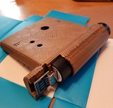

Welcome to MagneTag! We know you're anxious to play your first game -- this guide will help you get up and running as quickly as possible.

# Identifying Your MagneTag System

Before getting started, take a minute to [get to know your MagneTag system](know-your-system.md). This will help you ensure you've got all the hardware you need. It'll also help you identify your system -- this will make the rest of the documentation here a lot easier to understand.

# Turn it on
To get started, plug everything in and turn it on.

Insert the batteries into the armor vests. Power banks need to be turned on first; there is a small button near the charging port. When you press the button on the power bank, the color will indicate how much charge is left:
* Green: full charge
* Yellow: some charge
* Red: needs to charge

It might take a few minutes for everything to turn on. Once it's all on, your armor vests should light up, with white lights scrolling from one side to the other. The screen on the PC should show a video of people playing MagneTag.

If the armor vests don't light up or the PC doesn't start playing a video, refer to the troubleshooting page.

# Have some fun!

Now that the system is online, you're ready to play some games!

Choose the appropriate guide for your system. This will walk you through the basic steps involved in operating the game:
* [Run Self-Service (Kiosk) Mode](operating-kiosk-mode.md)
* [Run Full-Service (FEC) Mode](operating-fec-mode.md)
